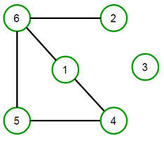
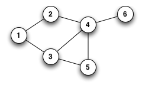
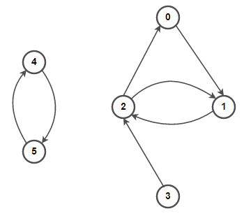
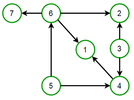
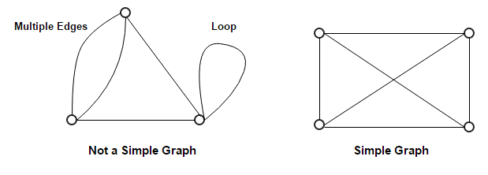
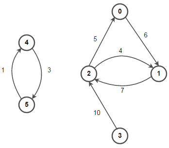
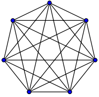
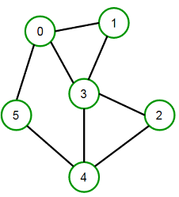

# Graphs



G = (V, E)
G -> Graphs
V -> Vertices, Nodes.
E -> Edges, Links.

A Graph:

- Is an abstract data type, that implements the undirected graph and directed graph concepts from the field of graph theory within math.
- Consists of a finite (and possibly mutable) set of vertices (Nodes or Points) together with a set of edges (arrows, links, or lines).
- Has nodes which are points in the graph that represent a place, location, or space within it.
- Edges are the connections between the Nodes in the graph.
- There may also be a value associated with the Edge, such as symbolic lable, a numberic attribute (cost, capacity, length, etc.), or any sort of data type.

Loop (self-loop, buckle):

- When an edge connects a node to itself in the form (x, x), where node x has been linked to itself.

## Types of Graphs

### Undirected Graph



- Is a graph in which edges have no orientation. The edge (x, y) is identical to edge (y, x).
- The maximum number of edges possible in an undirected graph without a *loop* is n*(n-1)/2

### Direct Graph



- Is a graph in which edges have orientation.

G = (V, E)

- V, a set of Vertices (nodes or points)
- E, a set of edges (directed edges, directed links, directed lines, arrows or arcs) which are ordered pairs of vertices.
- In the edge (x,y) directed from x to y, the vertices x and y are called the endpoints of the edge, x the tail of the edge and y the head of the edge.
- The edge is said to join x and y and to be *incident* on x and on y.
- A vertex may exist in a graph and not belong to and edge.
- The edge (y,x) is called the inverted edge of (x,y).
- Multiple edges, not allowed under the definition above, are two or more edges with both the same tail and the same head.

### Directed Acyclic Graph (DAG)



- Is a directed graph that contains no cycles.
- DAG consists of vertices and edges that don't form a closed loop across the entire graph.
- Such graphs are hard to traverse.

### Multi Graph

- A multigraph is an undirected graph in which multiple edges (and sometimes loops) are allowed. Multiple edges are two or more edges that connect the same two verices. A loop is an edge (directed or undirected) that connects a vertex to itself; it ay be permitted or not.

### Simple graph



- A simple graph is an undirected graph in which both multiple edges and loops are disallowed as opposed to a multigraph. In a simple graph with n vertices, every vertex's degree is at most n-1.

### Weighted and Unweighted graph



- A weighted graph associates a value or information (weight) with every edge in the graph. We can also use words cost or length instead of weight.

- An unweighted graph does not have any value (weight) associated with every edge in the graph. In other words, a unweighted graph is a weighted graph with all te edges' weight set to 1. Unless specified otherwise, all graphs are assumed to be unweighted by default.

### Complete Graph



- A complete graph is one in which every two vertices are adjacent: all edges that could exist are present.

### Connected Graph



- A connected graph has a path between every pair of vertices. In other words, there are no unreachable vertices. A disconnected graph is a graph that is not connected like the connected graph.

## Graph Traversal

### Depth-First Search (DFS)

- Is an algorithm for traversing a finite graph. DFS visits the child vertices before visitin the sibling vertices; that is, it traverses the depth of any particular path before exploring its breadth. A call stack via recursion is generatlly used when implementing the algorithm.
- Pseudocode:

``` Pseudocode DFS Algorithm
procedure DFS(G, v) is
    label v as explored
    for all edges e in G.incidentEdges(v) do
        if edge e is unexplored then
            w ← G.adjacentVertex(v, e)
            if vertex w is unexplored then
                label e as a discovered edge
                recursively call DFS(G, w)
            else
               label e as a back edge
```

### Breadth-First Search (BFS)

- is another technique for traversing a finite graph. BFS visits the sibling vertice before visiting the child vertices, and a queue is used in the search process.
- This algorithm is often used to find the shortest path from one vertex to another.
- Pseudocode:
  
``` Pseudocode BFS Algorithm
procedure BFS(G, v) is
    create a queue Q
    enqueue v onto Q
    mark v
    while Q is not empty do
        w ← Q.dequeue()
        if w is what we are looking for then
            return w
        for all edges e in G.adjacentEdges(w) do
            x ← G.adjacentVertex(w, e)
            if x is not marked then
                mark x
                enqueue x onto Q
    return null
```

## Shortest Path Algorithms

- In graph theory, the shortest path problem is the problem of finding a path between two vertices (or nodes) in a graph such that the sum of the weights of its constituent edges is minimized.
- The problem of finding the shortest path between two intersections on a road map may be modeled as a special case of the shortest path problem in graphs, where the vertices correspond to intersections and the edges correspond to road segments, ech weighted by the length of the segment.

### Definition

- The shortest path problem can be defined for graphs whether undirected, directed, or mixed.
- It's defined here for undirected graphs; for directed graphs the definition of path requries that consecutive vertices be connected by an appropriate directed edge.
- Two vertices are adjacnet when they are both incident to a common edge.
- A path in an undirected graph is a sequence of vertices P = (v_1, v_2, ... , v_n) ∊ V x V x ... x V such that v_i is adjacent to v_i+1 for 1 ≤ i < n.
- Such a path P is called a path of length n - 1 from v_1 to v_n. (The v_i variables; their numbering here relates to their position in the sequence and needs not to relate to any canonical labeling of the vertices.)
  
- Let e_ij be the edge incident to both v_i and v_j:
  - Given a real-valued weight function ⨍ : E -> R, and an undirected (simple) graph G, the shortest path from v to v' is the path P = (v_1, v_2, ... , v_n) (where v_1 = v and v_n = v') that over all posssible n minimizes the sum ∑ 𝑓(e_i,i+1) starting at i = 1, until n-1.
  - Where each edgein the graph has unit weight or 𝑓: E -> {1}, this is equivalent to finding the path with fewest edges.

- The problem is also sometimes called the *single-pair shortest path problem*, to distinguish it from the following variations:
  - The *single-source shortest path problem*, in which we have to find the shortest paths from a source vertex v to all other vertices in the graph.
  - The *single-destination path problem*, in which we have to find shortest paths from all vertices in the directed graph to a single destination vertex v. This can be reduced to the single-source shortest path problem by reversing the arcs in the directed graph.
  - The *all-pairs shortest path problem*, in which we have to find shortest paths between every pair of vertices v, v' in the graph.
  - These generalizations have significatntly more efficient algorithms than the simplistic approach of runing a single-pair shortest path algorithm on all relevant pairs of vertices.

### Paths in Graphs

- Consider a digraph G = (V, E) with edge-weight function w: E -> R.
- The weight of path p = v_1 -> v_2 -> ... -> v_k is defined to be:
- w(p) = ∑ w(v_i, v_i+1) starting at i = 1, until k - 1.
- Where every node is connected to the next node, until it reaches the end node.

### Shortest Paths

- A shortest path from u to v is a path of minimum weight from u to v. The shortest-path weight from u to v is defined to 
  - 𝜹(u,v) = min{w(p):p is a path from u to v}
  - *Note* 𝜹(u,v) = ∞ if no path from u to v exists.

#### Optimal Substructure

**Theorem** The subpath of the shortest path is a shortest path.

#### Triangle inequality

### Dijkstra's Algorithm

- saf

### Bellman-Ford's Algorithm

### Floyd-Warshall's Algorithm

### Prim's Algorithm

### Kruskal's Algorithm

#### Disjoint Sets

- Play a key role in the Kruskal's Algorithm
- A disjoint set is a data structure which keeps track of all elements that are separated by a number of disjoint (not connected) subsets.
- It supports three useful operations
  - make-set(x)
  - union(s1,s2)
  - find-set(x)

Graph Terminology
Tree Algorithms
